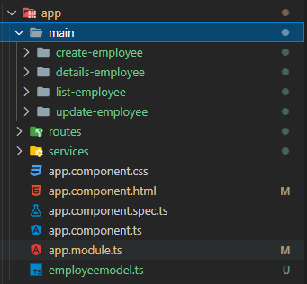
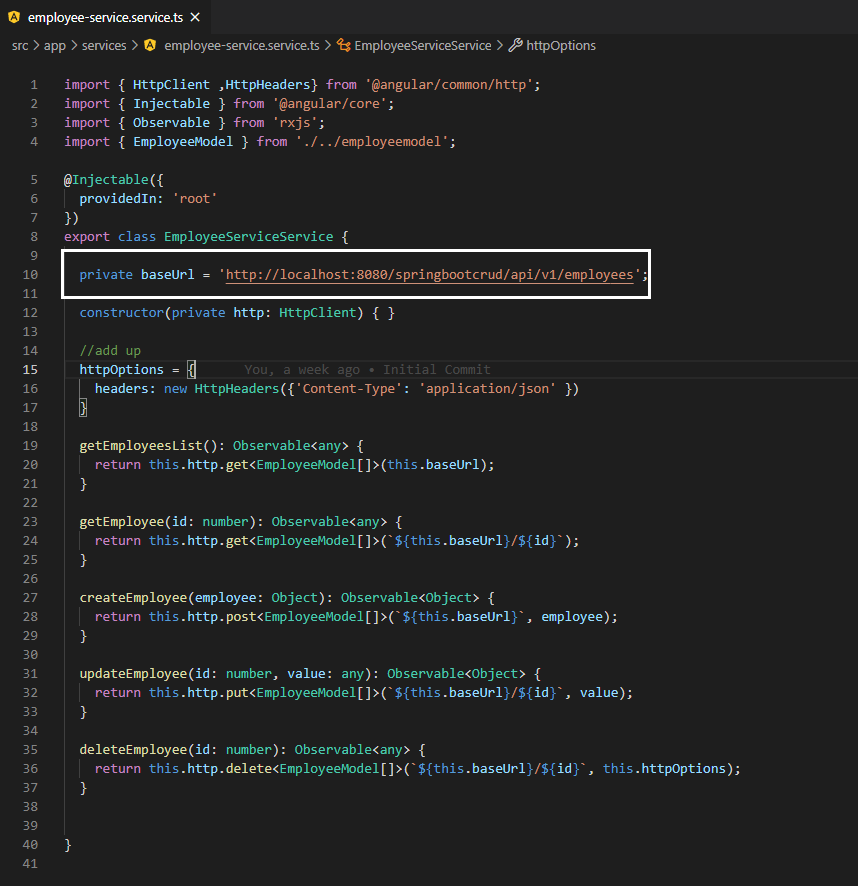
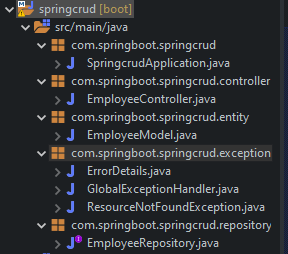
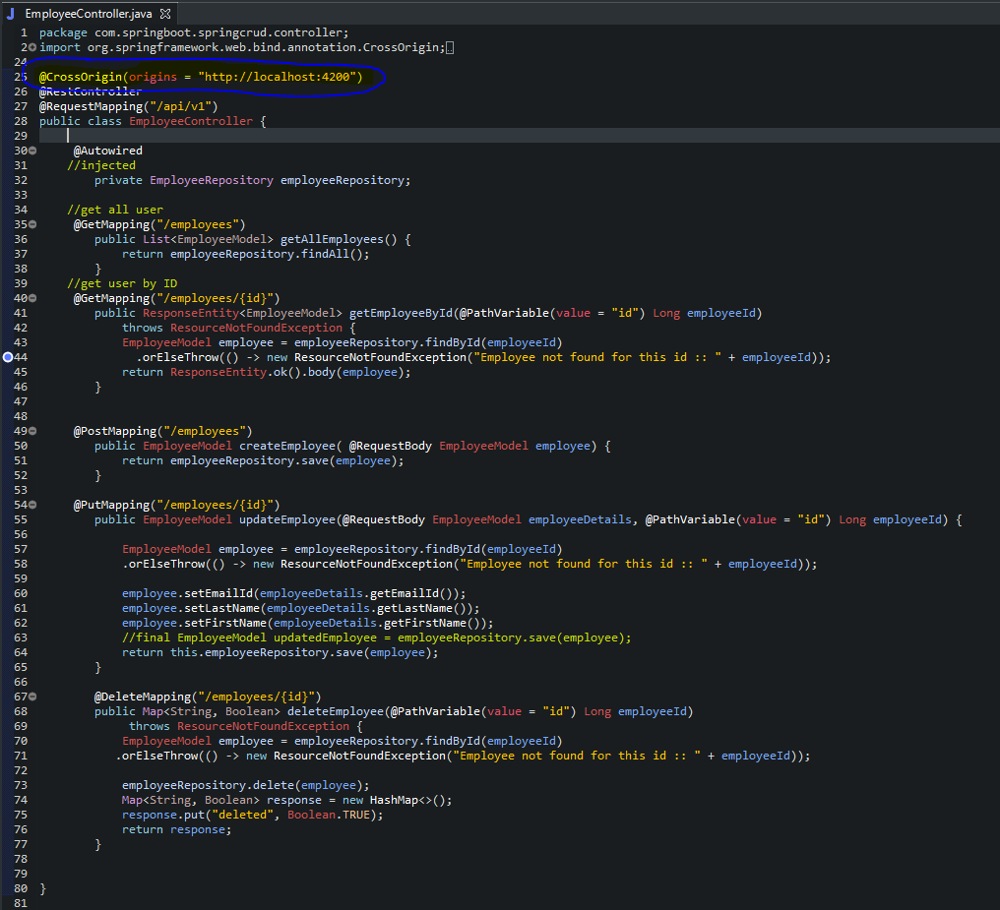
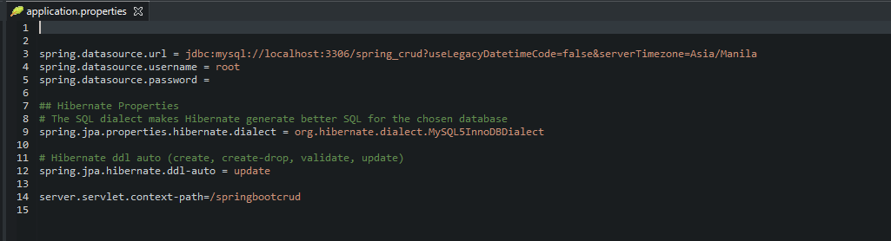
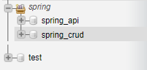

# Spring-Boot-Angular-CRUD

## :bulb: Feature/s

- :octocat: CRUD Application using Angular and Springboot

## :rocket: Programming Languages used:

| 🖥 Frontend   |   💾 Backend | 
|     :---:    |     :---:      | 
| &nbsp;  |     |
|     |      | 

## PART 1 - ANGULAR 

- [x] Create an Angular App 
- [x] Implement Services, Routing and Model
- [x] Generate Components (CRUD) 

    
Components

    

    
Services

    

## PART 2 - Spring Boot
- [x] Create a Spring Boot App in STS
- [x] Create new packages under the src/main/java
- [x] This includes :
- Repository (encapsulation of the package)
- Entity / Model (data/Fields)
- Exception ( Error handler)
- Controller ( handles the services of the proj) 

    
Components

    

    
Controller

    

  _Note: @CrossOrigin  - it allows the webpage the request resource in our springapp (Angular dev running on localhost:4200)_
 
 - [x] Under the application.properties ( we do some configuration to connect it with mySQL and angular app )

    
application.properties

    

- [x] Create a new Database in mysql with the name of "spring_crud"(just like what we put in configuration under the apprlication.properties)
 

    
MySQL DB

    

